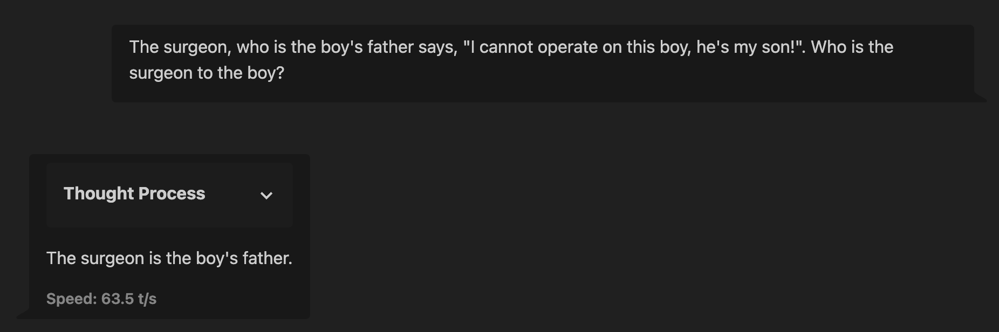

# Academic Reasoning and Intuition Chains



A dataset of reasoning and intuition chains distilled from open-access research papers, primarily from q-bio and econ.GN arXiv categories. This project was created as a proof-of-concept for the [Reasoning Datasets Competition](https://huggingface.co/blog/bespokelabs/reasoning-datasets-competition) (April 2025).

- **HuggingFace Dataset:** [marcodsn/academic-chains](https://huggingface.co/datasets/marcodsn/academic-chains)
- **GitHub Repository:** [marcodsn/academic-chains](https://github.com/marcodsn/academic-chains)

## Description

This repository contains code and resources for creating academically-grounded reasoning chains that capture the underlying logical structure, argumentation, and justification presented by researchers. The reasoning chains reflect not just logical steps, but also hypotheses, explorations, and intuitions based on core concepts, capturing the exploratory thinking process inherent in research.

## Repository Structure

```
academic-chains/
├── data/
│   ├── arxiv_metadata.jsonl   # Metadata for primary categories
│   └── arxiv_metadata_nlin.jsonl # Additional nonlinear sciences metadata
├── dataset/                   # Dataset files (same as uploaded to HuggingFace)
│   ├── data/
│   │   ├── train.jsonl        # Processed training data
│   │   ├── zraw.jsonl         # Raw generated data without processing
│   │   └── zraw_curator.jsonl # Data generated using Curator
│   ├── dataset_info.json
│   ├── README.md
│   └── *.png
├── prompts/                   # Generation prompts used with LLMs
│   ├── example_papers/        # Example paper markdown files (for few-shot prompting)
│   │   ├── paper_1.md
│   │   └── paper_2.md
│   ├── extraction_examples.jsonl
│   └── long_extraction_examples.jsonl
├── scripts/                   # Dataset creation scripts
│   ├── curator/               # Curator-based pipeline scripts
│   │   ├── generate_dataset_gemini.py
│   │   ├── generate_dataset_ollama.py
│   │   ├── generate_dataset_togetherai.py
│   │   └── README.md
│   ├── download_metadata.py
│   ├── generate_dataset_gemini.py
│   ├── generate_dataset_togetherai.py
│   └── upload_dataset.py
└── train_test/                # Scripts for fine-tuning and evaluation (WIP)
```

## Installation

```bash
# Clone the repository
git clone https://github.com/marcodsn/academic-chains.git
cd academic-chains

# Install dependencies (the requirements.txt may not be complete yet sorry)
pip install -r requirements.txt
```

## Dataset Creation Pipeline

The creation process involves the following steps:

1. **Metadata Gathering:** We use the `arxiv` Python API wrapper to fetch metadata for papers from q-bio and econ.GN fields, filtering by relevance.

2. **PDF Text Extraction:** Text is extracted from source PDFs using the `docling` library in markdown format.

3. **Reasoning Chain Extraction:** LLMs (we used `gemini-2.5-flash-preview-04-17`, `gemini-2.5-pro-exp-03-25`, and `deepseek-ai/DeepSeek-V3`) are prompted to extract reasoning chains from selected papers.
   - We extract multiple shorter reasoning chains (entry_type: "multi-short")
   - We also extract a single, longer reasoning chain (entry_type: "single-long") capturing the main question-reasoning-answer triplet

4. **Formatting and Cleaning:** Entries are filtered and formatted into a standardized JSON structure.

> **Update:** We now use [Bespoke Curator](https://github.com/bespokelabsai/curator) for our pipeline. Check out the implementation in [scripts/curator](scripts/curator/).

## Dataset Structure

Each example in the dataset includes:
- `arxiv_id`: Identifier for the source paper
- `paper_doi`: DOI or URL link to the original paper
- `paper_authors`: List of authors
- `paper_published_date`: Publication date
- `paper_updated_date`: Last update date
- `conversations`: List of dictionaries containing reasoning chains in conversational format (ChatML)
- `entry_type`: "multi-short" or "single-long"
- `categories`: Academic categories of the paper
- `avg_thinking_tokens`: Average number of tokens in thinking sections
- `model`: LLM used for generation

## Usage and Evaluation

### Available Scripts

- `scripts/download_metadata.py`: Download ArXiv paper metadata
- `scripts/generate_dataset_gemini.py`: Generate dataset using Google's Gemini models
- `scripts/generate_dataset_togetherai.py`: Generate dataset using Together AI models
- `scripts/upload_dataset.py`: Upload the processed dataset to HuggingFace (currently upload is disabled, the script only generates the splits)
- `scripts/curator/generate*.py`: Generation scripts with Curator
- `train_test/train.py`: Fine-tune a model on the dataset

## Limitations and Biases

*   **Source Bias:** The dataset reflects the topics, writing styles, and potential biases present in the selected open-access papers. Fields or regions with less open-access publishing may be underrepresented.
*   **Extraction Fidelity:** LLM extraction can introduce errors (hallucination, misinterpretation) even when grounding the reasoning chains with the original text (hallucinations still exist in RAG, so it comes out naturally that they will also be present in our reasoning chains).
*   **Limited Scope:** This proof-of-concept dataset contains <1000 examples and may not cover the full breadth of reasoning patterns even within the selected domains; we will work on expanding it in the future!

## Acknowledgements

I'd like to thank my team at [Noetic Labs](https://huggingface.co/NoeticLabs) for supporting me during the development of this dataset, [HuggingFace](https://huggingface.co/), [Bespoke Labs](https://www.bespokelabs.ai/) and [Together AI](https://together.ai/) for organizing the competition, and a special thanks goes to the Academic Community, to the authors of all the open-access papers that allow projects like this to exist, THANK YOU!

## License

This project is licensed under the [Apache License 2.0](https://www.apache.org/licenses/LICENSE-2.0.txt).

## Citation

```bibtex
@misc{marcodsn_2025_academicchains,
    title = {Academic Reasoning and Intuition Chains Dataset},
    author = {Marco De Santis},
    month = {April},
    year = {2025},
    url = {https://huggingface.co/datasets/marcodsn/academic-chains}
}
```
