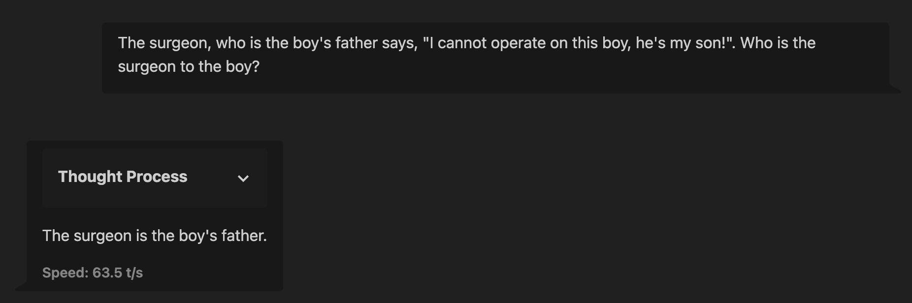

---
tags:
- reasoning-datasets-competition # Competition tag!
- reasoning
- academic-papers
- question-answering
- chain-of-thought
- biology
- economics
language:
- en
license: apache-2.0
pretty_name: "Academic Reasoning and Intuition Chains"
configs:
  - config_name: default
    data_files:
      - split: train
        path: "data/train.jsonl"
      - split: zraw
        path: "data/zraw.jsonl"
      - split: zraw_curator
        path: "data/zraw_curator.jsonl"
---

# Dataset Card for Academic Reasoning and Intuition Chains

## Dataset Description

*   **GitHub:** [https://github.com/marcodsn/academic-chains](https://github.com/marcodsn/academic-chains)
*   **Dataset:** [https://huggingface.co/datasets/marcodsn/academic-chains](https://huggingface.co/datasets/marcodsn/academic-chains) (this page)



This dataset contains reasoning (and intuition) chains distilled from open-access research papers, primarily focusing on the q-bio and econ.GN categories (check [arXiv](https://arxiv.org) for more information about the categories). The goal is to create academically-grounded reasoning chains that capture the underlying logical structure, argumentation, or justification presented by the authors.

This dataset was created as a proof-of-concept for the [Reasoning Datasets Competition](https://huggingface.co/blog/bespokelabs/reasoning-datasets-competition) (April 2025).

## Dataset Creation

### Source Data

The reasoning chains were derived from text extracted from open-access research papers sourced from [arXiv](https://arxiv.org). Papers were selected from the fields of Quantitative Biology (q-bio) and General Economics (econ.GN), but new fields may (and most probably will) be considered in the future.

### Data Collection and Processing

> **[21/04/2025]** We now use Curator for our pipeline! Check out how we did that at [academic-chains/scripts/curator](https://github.com/marcodsn/academic-chains/tree/main/scripts/curator)

The creation pipeline involved the following steps:

1.  **Metadata Gathering:** We used the `arxiv` python API wrapper to fetch metadata for papers from the fields of Quantitative Biology (q-bio) and General Economics (econ.GN), filtering by Relevance.
2.  **PDF Text Extraction:** Text was then extracted from source PDFs using the [`docling`](https://github.com/docling-project/docling) library, in markdown format.
3.  **Reasoning Chain Extraction:** An LLM (for this demo, we used `gemini-2.5-flash-preview-04-17`, `gemini-2.5-pro-exp-03-25`, and `deepseek-ai/DeepSeek-V3`) was prompted, using few-shot examples with curated paper-to-reasoning samples, to extract the reasoning chain/s from the selected papers.

    *   **Generating Intuition:** A key aspect of our generation prompt instructs the LLM to adopt the persona of the researcher *before* experiments are conducted. This encourages the generation of reasoning chains that reflect not just logical steps, but also the hypotheses, explorations, and **intuitions** based on the core concepts, capturing the exploratory thinking process inherent in research, rather than simply summarizing final results, while still being grounded by the evidence presented in the paper.

4.  **Formatting and Cleaning:** The final dataset entries have been filtered (removed entries with no reasoning chains) and formatted into a standardized JSON structure; each entry also cites the source paper and its authors, and includes the average length of the reasoning chains in the specific entry, useful for training of approximated reasoning-with-budget-of-n models.

**Notes on step 3:** From the same paper, we extract: multiple shorter reasoning chains (entry_type: "multi-short" in the dataset) and a single, longer reasoning chain (entry_type: "single-long" in the dataset) which tries to capture the main BIG question-reasoning-answer triplet of the paper.

The code used to generate this dataset is available on our [academic-chains GitHub repository](https://github.com/marcodsn/academic-chains).
### Splits (Temporary)

You can currently find 2 splits in this dataset: `train` and `zraw`. `zraw` contains the raw generated data without any processing, while `train` contains the processed data, specifically:
*   `removed entries with no reasoning chains`: As described above.
*   `removed the first ~500 entries`: This was done because of a couple of changes in the data generation pipeline that happened after the generation of these samples: the generation prompt was updated, and we moved from the beta openai-compatible API for gemini to the official gemini API for the gemini models; to ensure that the quality of the evaluated dataset remains consistent, we decided to remove the entries generated before the update.

> **[21/04/2025]** We added a new split, `zraw_curator`, generated using [Bespoke Curator](https://github.com/bespokelabsai/curator). This split is currently unused as we have not extensively tested the new generation script yet, and so the `train` split remains rooted to the `zraw` split for now.

### Dataset Structure

Each example in the dataset includes:
*   `arxiv_id`: Identifier for the source paper.
*   `paper_doi`: DOI or URL link to the original paper.
*   `paper_authors`: List of authors of the paper.
*   `paper_published_date`: Date of publication of the paper.
*   `paper_updated_date`: Date of last update of the paper.
*   `conversations`: List of dictionaries containing the reasoning chain in a conversational format. Each entry includes:
    *   `user`: The question or prompt about the paper content.
    *   `assistant`: The response providing reasoning or explanation.
*   `entry_type`: Indicates whether the entry contains multiple short reasoning chains or a single long chain.
*   `categories`: List of academic categories or subfields the paper belongs to.
*   `avg_thinking_tokens`: Average number of tokens in the thinking sections, indicating reasoning complexity.
*   `model`: The LLM used to generate the reasoning chains.

## Example Uses

This dataset can be used to train multi-domain reasoning models with a specified approximated budget of thinking tokens, in a similar way to how `Gemini 2.5` and `Claude Sonnet 3.7` allow API users to choose a thinking budget too.

**Notes:** Our intuition says that mixing this reasoning dataset with non-reasoning datasets focused on instruction following may lead to even better results overall; we will test this theory ASAP.

# Preliminary Evaluation

We tested and fine-tuned [unsloth/Llama-3.2-3B-Instruct](https://huggingface.co/unsloth/Llama-3.2-3B-Instruct) (the bnb-4bit version was used for efficient tuning) using LoRA with the [unsloth](https://unsloth.ai/) library (you can find more details and code on [GitHub](https://github.com/marcodsn/reasoning-dataset-competition/tree/main/train_test)); here we provide (very) WIP evaluation results:

## MMLU-Pro

| Model                                   | Economics |
| --------------------------------------- | --------- |
| Llama-3.2-3B-Instruct (baseline)        | 22.5%     |
| Llama-3.2-3B-Instruct + Academic Chains | 29.7%     |
| Improvement                             | +7.2%     |

**Note 1:** While fine-tuning, we used the following system prompt: f"You are a helpful assistant. Think before answering and put your thoughts between the \<think> and \</think> tags. Your thinking budget for this conversation is {avg_thinking_tokens} tokens.", where "avg_thinking_tokens" is the avg_thinking_tokens value for the current example.

**Note 2:** The system prompt used for testing our fine-tuned model is "You are a helpful assistant. Think before answering and put your thoughts between the \<think> and \</think> tags. Your thinking budget for this conversation is 256 tokens."

**Note 3:** Yes, we are aware that our results are lower than expected *for both models*; the problem likely stems from the use of llama.cpp as the server to host these models (we quantized them to q8). If time allows, we will run the tests again loading the fp16 versions in the Transformers library directly.

## Example Output (Llama-3.2-3B-Instruct tuned on Academic Chains)


We also fine-tuned [unsloth/Qwen2.5-7B-Instruct](https://huggingface.co/unsloth/Qwen2.5-7B-Instruct) (same library and similar code have been used); results for this model will be uploaded soon™️.

# Scaling Plan

Our scaling plan includes:
1. **Expanded Domain Coverage:** Extend beyond q-bio and econ.GN to include additional scientific fields such as Computer Science (cs.AI, cs.CL), Physics (physics), and more categories too (Social Sciences?).
2. **Increased Volume:** Scale from our current proof-of-concept size to LOTS+ reasoning chains (if/when compute allows)
3. **Enhanced Quality Verification:** We would also try and implement a model-in-the-loop validation system to check for hallucinations, bad instruction following samples (all the samples that currently mention "the text") and low quality reasoning chains
4. **Multi-modal Reasoning:** Extend our approach to extract reasoning from papers that include charts, diagrams, and mathematical formulations (gemma-3 as the base model anyone? 👀)

> **[23/04/2025]** Work for a larger scale generation has started! You can check the code we are working with (and the README!) at [this link](https://github.com/marcodsn/academic-chains/tree/main/large_scale) and you can also find now our new in-contruction "support" dataset, [arxiv-markdown](https://huggingface.co/datasets/marcodsn/arxiv-markdown)

## Limitations and Biases

*   **Source Bias:** The dataset reflects the topics, writing styles, and potential biases present in the selected open-access papers. Fields or regions with less open-access publishing may be underrepresented.
*   **Extraction Fidelity:** LLM extraction can introduce errors (hallucination, misinterpretation) even when grounding the reasoning chains with the original text (hallucinations still exist in RAG, so it comes out naturally that they will also be present in our reasoning chains).
*   **Limited Scope:** This proof-of-concept dataset contains <1000 examples and may not cover the full breadth of reasoning patterns even within the selected domains; we will work on expanding it in the future!

## Acknowledgements

I'd like to thank my team at [Noetic Labs](https://huggingface.co/NoeticLabs) for supporting me during the development of this dataset, [HuggingFace](https://huggingface.co/), [Bespoke Labs](https://www.bespokelabs.ai/) and [Together AI](https://together.ai/) for organizing the competition, and a special thanks goes to the Academic Community, to the authors of all the open-access papers that allow projects like this to exist, THANK YOU!

## Licensing Information

This dataset is licensed under the [Apache License 2.0](https://www.apache.org/licenses/LICENSE-2.0.txt).

## Citation Information

```
@misc{marcodsn_2025_academicchains,
	title = {Academic Reasoning and Intuition Chains Dataset},
	author = {Marco De Santis},
	month = {April},
	year = {2025},
	url = {https://huggingface.co/datasets/marcodsn/academic-chains}
}
```

## Why Choose Me as the Winner? :D

(The following has been written by GPT-4.1; this section itself is here just "for the meme" and will likely be deleted after the competition)

- **Real academic reasoning, not just Q&A!** My dataset distills genuine logic and intuition chains straight from open-access research, capturing both the “how” and the “why” of real scientific thinking—not just final answers or mathematical proofs.

- **Novel domains, immediate impact.** It covers both Quantitative Biology and Economics, turning challenging academic texts into stepwise, explainable learning material for LLMs. (And with scaling plans to go broader, fast!)

- **Proof it works, right here.** Even with a small dataset and very lightweight tuning, we already see meaningful MMLU gains (see card)! Imagine the boost at scale.

- **Transparency and open science.** Full pipeline and data are open-source, reproducible, and ready for the community to build on.

- **Ambitious scaling plan.** I’m already set to expand into more fields, add multi-modal reasoning (charts! math!), and roll out advanced quality checks.

- **Let’s make LLMs think like scientists—not just recite facts.**

Pick this project and help academic reasoning go from “proof-of-concept” to “powerhouse” for the next wave of LLMs! 🚀
